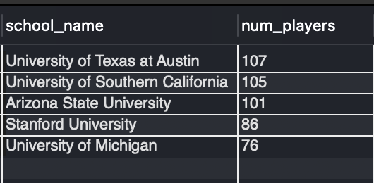

# ⚾ SQL Analysis – MLB Data

This section contains all the **SQL queries and sample outputs** used in the project.  
---
## Part I: School Analysis
**Task 1:** In each decade, how many schools produced players?  
➡️ [Query](./school_analysis.sql)  

**Task 2:** Top 5 schools that produced the most players.  
➡️ [Query](./school_analysis.sql)  

**Task 3:** In each decade, top 3 schools producing most players.  
➡️ [Query](./school_analysis.sql)  

---

## Part II: Salary Analysis
**Task 1:** Return the top 20% of teams in terms of average annual spending.  
➡️ [Query](./salary_analysis.sql)  

**Task 2:** For each team, cumulative sum of spending over years.  
➡️ [Query](./salary_analysis.sql)  

**Task 3:** First year each team’s cumulative spending surpassed 1B.  
➡️ [Query](./salary_analysis.sql)  

---

## Part III: Player Career Analysis
**Task 1:** Calculate player debut age, final age, and career length.  
➡️ [Query](./career_analysis.sql)  

**Task 2:** Starting and ending teams for each player.  
➡️ [Query](./career_analysis.sql)  

**Task 3:** Count players who started & ended on same team and played 10+ years.  
➡️ [Query](./career_analysis.sql)  

---

## Part IV: Player Comparison Analysis
**Task 1:** Which players share the same birthday?  
➡️ [Query](./player_comparison.sql)  

**Task 2:** Team-level summary of batting hand distribution (R/L/B).  
➡️ [Query](./player_comparison.sql)  

**Task 3:** Trend of average height & weight at debut across decades.  
➡️ [Query](./player_comparison.sql)  

---
## 📝 Sample Output
**Task: Top 5 schools producing most players**

